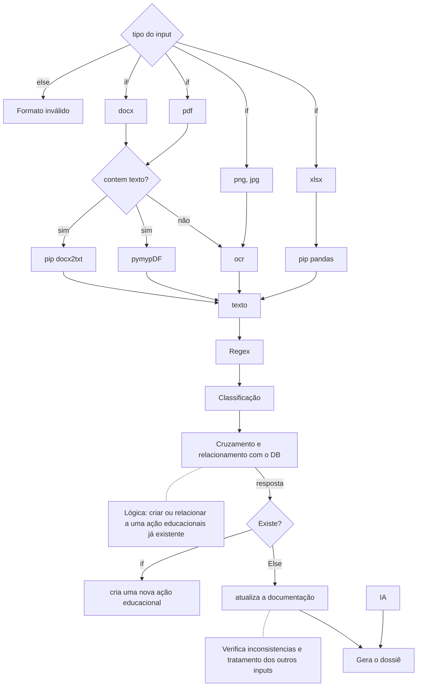

# Hackathon-Emeras


## Getting started
##### planned logic:



To make it easy for you to get started with GitLab, here's a list of recommended next steps.


## Test and Deploy
Use the built-in docker-compose.yml to deploy all in 2times

```bash
git clone https://gitlab.com/hackathon-group6750332/hackathon-emeras.git
docker compose --build
```
That's it!

## Visuals
Depending on what you are making, it can be a good idea to include screenshots or even a video (you'll frequently see GIFs rather than actual videos). Tools like ttygif can help, but check out Asciinema for a more sophisticated method.


## License
For open source projects, say how it is licensed.